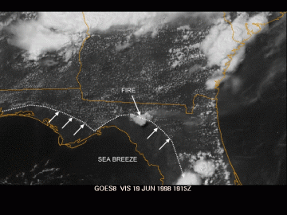
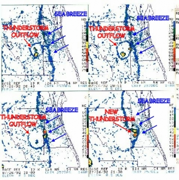
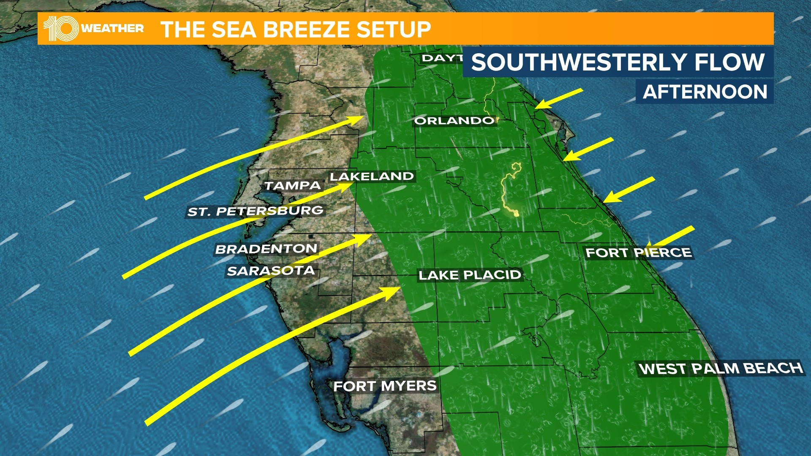
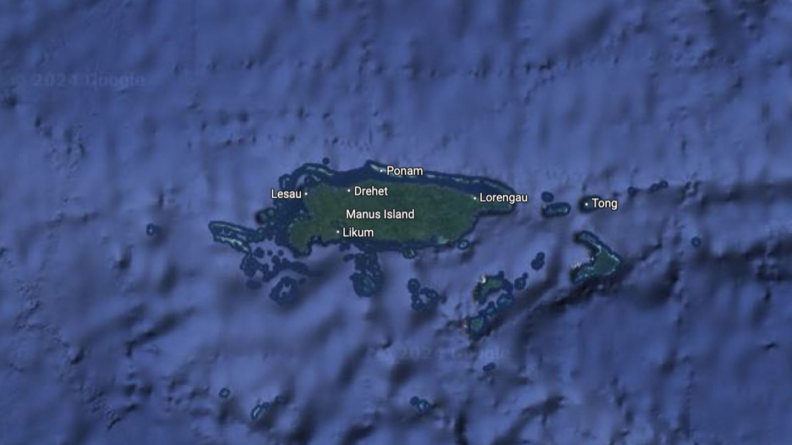
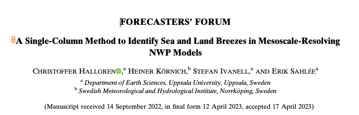

# Land-Sea breeze work

---

## Land-Sea breeze 

- Diffrential heating between land and water causes winds from sea (**sea breeze**) at daytime 
- reversal during the night-time winds from land (**land breeze**) 

---

## In real-world (Florida Melbourne)

---

---

## The problem

1. It is difficult to predict the land-sea breeze onset.
2. For smaller regions (such as islands) there is no dominant wind direction.
3. There are no studies/models that predict the onset of land-sea breeze for smaller regions (or even for larger regions).

---

## Land-Sea breeze index (single column)

- A simple index that will predict the onset of land-sea breeze based on single column data. 

---

## The proposal (short-term)

1. Using existing single column model to create the land-sea breeze index with available observational ~14 year data

2. Create a deep learning categorical classifier to predict the onset of land-sea breeze for smaller regions using the same index.

3. Improve the model using different varibles such as SST, wind speed, etc.

4. Tune the model to predict the onset of land-sea breeze for larger regions.

---

## Long-term 

- Create a model that can predict the onset of land-sea breeze for any region in the world.
---

### Questions 

1. What might be a best method to approach this problem? 

2. Can we use genetic algorithms to tune the model? ( or to find the best variables that can predict land-sea breeze)